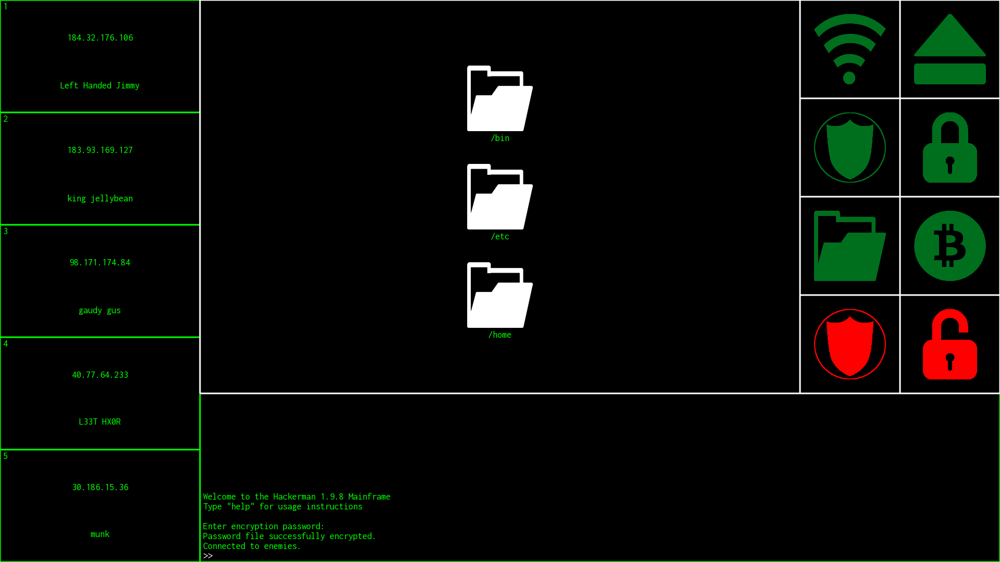

# Hackerman

Think of a bulky computer terminal with green text quickly scrolling as one "hacks" a government agency or something silly like that. That is the essence of this game. You are a hacker at a terminal trying to hijack opponents' Bitcoin wallets. As you do this, you are being attacked by rivals. As such, you use your Bitcoin acquired from opponents to update your hacking equipment. This is accomplished by completing tasks which are unrelated to hacking, but nonetheless fun.

### Game premise
In Hackerman, you are using a computer terminal and trying to hack into enemies' computers
to steal their Bitcoin wallets. With the Bitcoins you acquire, you can upgrade your equipment to hack all of your opponents.

### Game instructions
When starting Hackerman, you are not connected to opponents, so you are not vulnerable to being hacked. During this you should:
* deploy your firewall by using the green shield button on the utility panel to the right
* encrypt your Bitcoin wallet by navigating to `/etc` and using the green padlock button on the utility panel

Next, you should connect to opponents by using the connect button on the utility panel on the right. After this, you should select an enemy and attack their firewall by clicking on the red shield on the utility panel. After their firewall has been taken down, you are free to bruteforce to decrypt their Bitcoin wallet. Do this by clicking the red padlock button on the utility panel and typing numeric password attempts into the console at the bottom of the screen. The console will tell you which numbers you have gotten right in the password.

After you have decrypted your enemy's Bitcoin wallet, you have eliminated them and stolen their Bitcoins. You can use these at the store to upgrade your shield or unlock the "sh upgrade" which allows you to type access your computer's command line through the console in the game by using the command `sh`.

Disconnecting from enemies keeps you from being attacked and attacking, but also deploys your enemies' firewalls.

In addition to using the utility panel on the right of the game interface, players can use the game by the command line or by executing the programs present in the `/bin` file in the game

### Program usage
To run the game, execute the program with these flags:  
final-project-maxweis *[resolution_x] [resolution_y]*

### Build
Dependencies :
* openFrameworks
* boost

To build on Unix based operating systems use the following commands:
   
`cd final-project-maxweis`
 `make`
 

To then run the program, execute the binary in `final-project-maxweis/bin/final-project-maxweis`
### Inspiration
Inspiration by classic "hacking" games such as Hacknet, Sunrise Hackathon, etc.
